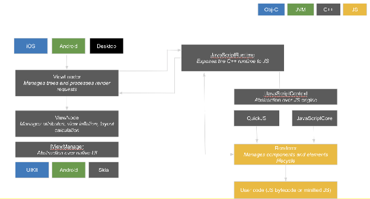

# Valdi Runtime Internals

This document provides a deep dive into the Valdi C++ Runtime, its data representation, and the communication protocol between TypeScript and native code.

## Architecture Overview

The Valdi C++ runtime provides a high-performance environment for executing Valdi components. It integrates a JavaScript engine (QuickJS on Android/Desktop, JavaScriptCore on iOS) and a cross-platform layout engine (Yoga).

### Key Responsibilities
- **JS Engine Integration**: Managing the lifecycle of the JavaScript environment.
- **Layout Engine**: Calculating element positions and sizes using the Web Flexbox specification.
- **Element Synchronization**: Processing update commands from the TypeScript framework.
- **Platform Integration**: Bridging to iOS (UIKit), Android (Views/Skia), and Desktop (Skia).

## Data Representation: `Valdi::Value`

`Valdi::Value` is the core data container used to pass information across the bridge between C++, JavaScript, Objective-C, and Java.

### Characteristics
- **128-bit Container**: Uses 64 bits for data storage (or a pointer) and 64 bits for type metadata.
- **Thread-Safe & Immutable**: Can be safely passed across threads without explicit synchronization.
- **Reference Counted**: Complex types like Maps and Arrays are heap-allocated and ref-counted.
- **Zero-Copy Marshalling**: Designed to minimize heap allocations when passing data across the bridge.

### Supported Types
- Null / Undefined
- Boolean
- 32-bit Integer / 64-bit Long
- 64-bit Double
- String (Interned via `StringBox`)
- Map (`ValueMap`) / Array (`ValueArray`)
- Function / Error
- TypedArray
- `ValdiObject` (Abstract base for native objects)

## Optimization: Interned Strings

To optimize memory and performance, Valdi uses **Interned Strings**. Every unique string value is stored once in a global `StringCache`.

- **`StringBox`**: A value type that holds a reference to an interned string.
- **Fast Comparison**: String equality is a simple pointer comparison.
- **Efficient Maps**: Map lookups use pre-calculated hashes stored with the interned string.

## Communication Protocol: `RenderRequest`

When the TypeScript `Renderer` completes a render pass, it submits a `RenderRequest` to the C++ runtime.

### `RenderRequest` Structure
1. **`treeId`**: Identifies the specific element tree being updated.
2. **`descriptor`**: An `ArrayBuffer` containing a serialized binary protocol of commands.
3. **`values`**: An array of non-serializable TypeScript values (e.g., functions, native object references).

### Binary Protocol (`RenderRequestDescriptor`)
The protocol is optimized for minimal marshalling overhead. Each command starts with a 4-byte header:
- **1 byte**: `CommandType` (Enum)
- **3 bytes**: `ElementId` (The target element)

#### Common Commands
| Command | Size | Description |
| :--- | :--- | :--- |
| `CreateElement` | 8 bytes | Creates a new native view of a specific class. |
| `DestroyElement` | 4 bytes | Recursively destroys an element subtree. |
| `MoveElementToParent` | 12 bytes | Inserts or moves an element within a parent. |
| `SetAttributeInt` | 12 bytes | Sets a numeric attribute on an element. |
| `SetAttributeStyle` | 12 bytes | Applies a pre-interned style object. |
| `SetAttributeAttachedValue` | 12 bytes | References a value from the `values` array. |

## Module System & Loading

Valdi implements a custom module loader inspired by Node.js but optimized for mobile.

### Lazy Loading
By default, Valdi modules are **lazy-loaded**. When a module is `require()`'d, the loader returns an **ES6 Proxy**. The actual evaluation of the module code only happens when a property of the proxy is accessed.
- **Benefit**: Significantly reduces cold start time by avoiding the evaluation of unused code.
- **Trade-off**: Slightly less deterministic runtime performance during the first access.

### `JsEvaluator`
The `JsEvaluator` is a C++ function that:
1. Resolves the absolute path to a file within a `.valdimodule` archive.
2. Evaluates the JavaScript code within the engine.
3. Returns the module function and optional source maps for debugging.

> [!Note]
> Valdi cannot evaluate raw `.js` files directly. It must evaluate files from `.valdimodule` archives produced by the Valdi compiler. This allows Valdi to run in a standalone mode (without UI) for scripts and unit tests, similar to Node.js.

## Component Instantiation & Management

### `ComponentPath`
A `ComponentPath` is a string that tells the runtime how to locate and instantiate a component class. It is primarily used for the root component of a feature.
- **Format**: `<symbol_name>@<module_name>/<file_path>`
- **Example**: `RootComponent@my_module/src/Root`

### `RootComponentsManager`
The `RootComponentsManager` is the primary interface between the C++ runtime and the TypeScript framework.
- **Lifecycle**: It manages the creation, update, and destruction of all root components in the application.
- **Hot Reloading**: It registers observers on the TypeScript modules. When a module or its dependency is swapped, the manager resolves the new constructor and triggers a re-render of the affected component hierarchy.
